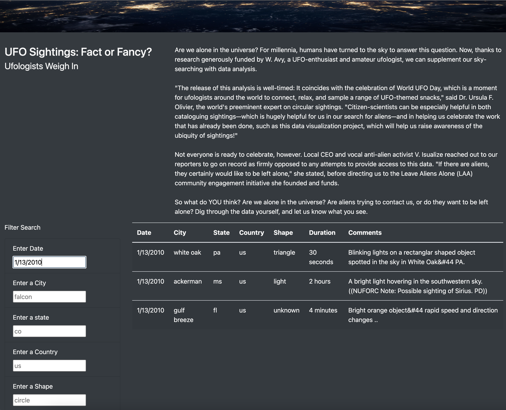

# UFOs

## Overview of Project
In-depth analysis of UFOs sightings utilizing various criteria.  

## Results
The UFO Sightings website allows the users to filter data by date, city, state, country and shape. 

.

## Summary
One of the drawbacks of the current website is the person looking for the information need to have some background knowledge regarding the dates and geographic locations of UFO sightings.  

In the future updates, the website has a potential to be more user-friendly such as having a drop down menu with a choice of dates, cities, states, etc where UFO sightings have been recorded. 
